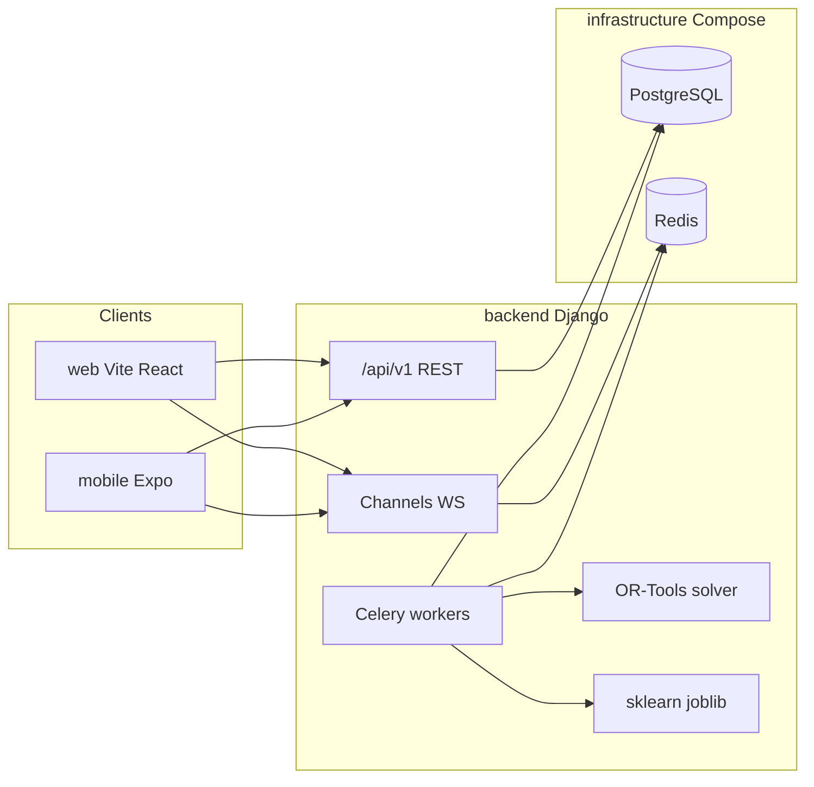
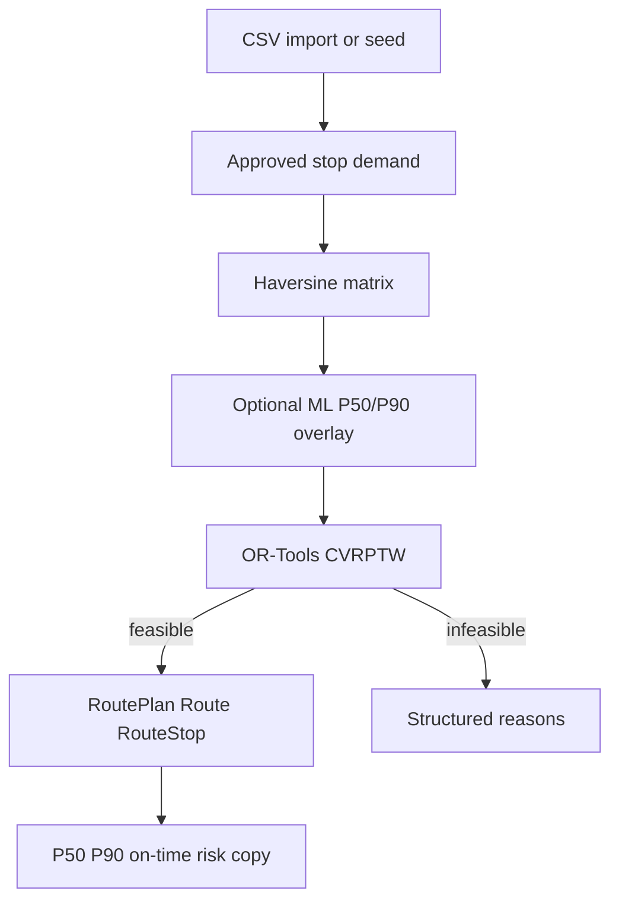
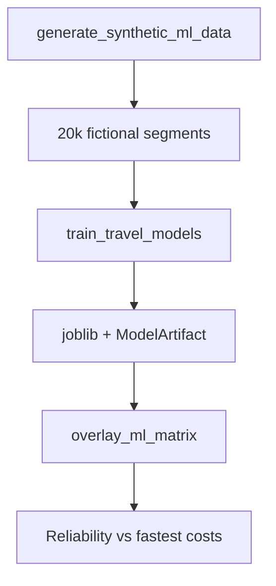
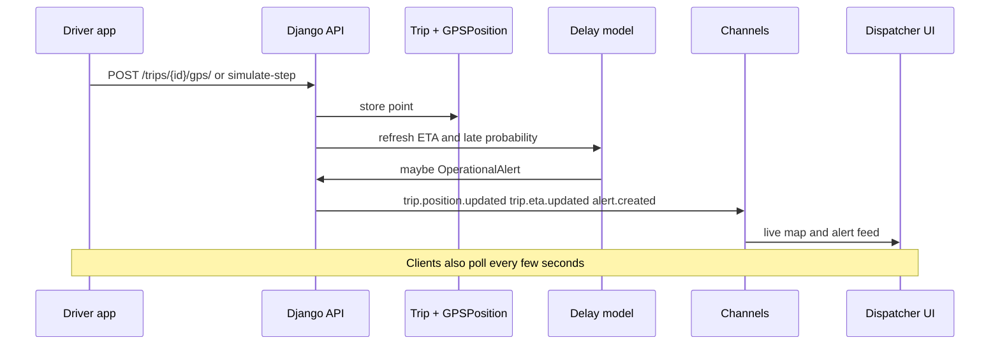
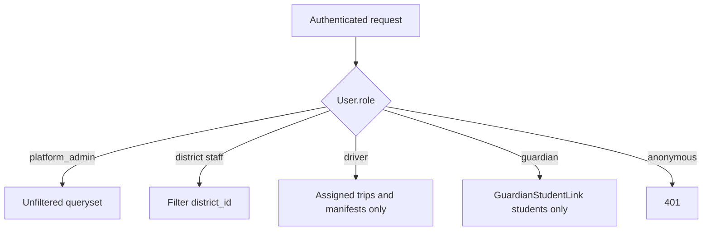

# Architecture

RouteWise is a proof of concept, not a production student transportation system.

## Client / backend

`web/`, `mobile/`, and `backend/` are independent applications. They do not share UI code. Both clients use `/api/v1/` and poll as a realtime fallback.

## Optimization pipeline

## ML pipeline

## Real-time GPS

## Tenant isolation

Latitude/longitude are stored as decimals so Django can run on Windows without GDAL. The Compose image is PostGIS for a future spatial upgrade. Travel times use Haversine, not PostGIS.

Web access tokens live in `sessionStorage` with refresh in `localStorage` (POC). Mobile tokens use Expo Secure Store only.
